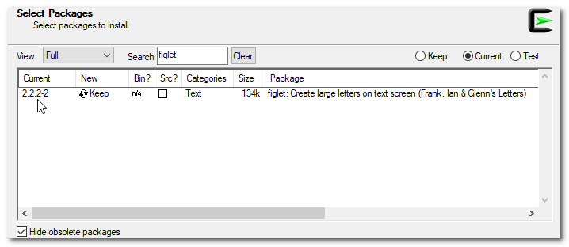

## Debian

The package is available in Jessie branch

``> sudo apt-get install figlet``

## OSX

``brew install figlet``

## Windows

###  Cygwin

The figlet package is available during the Cygwin setup.

### Bash Ubuntu for Windows

The Bash Ubuntu is now available under Windows 10; and fortunally the figlet package is already available for installation.

``> sudo apt-get install figlet``

### Msys2

First install the nodejs package, if not already
``pacman -S mingw-w64-x86_64-nodejs``

then install the packages available with npm
``npm install figlet``
``npm install -g figlet-cli``

